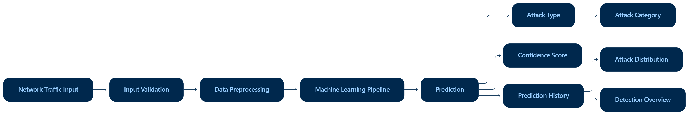

# AI-Based Network Intrusion Detection System

<p align="center">
  <b>Machine Learning-Based Network Traffic Detection and Classification</b>
</p>

<p align="center">
  A Flask-based web application that uses machine learning to identify normal and malicious network traffic using the NSL-KDD dataset.
</p>

<p align="center">
  
  
  
  
  
</p>

---

## Overview

The **AI-Based Network Intrusion Detection System (NIDS)** is a machine learning and Flask-based cybersecurity application developed to detect and classify network traffic.

The system analyzes network traffic features and predicts whether the traffic is:

- **Normal**
- **Malicious**

For malicious traffic, the system identifies the specific attack type and maps it to a broader attack category such as **DoS, Probe, R2L, or U2R**.

The trained machine learning model is integrated with a Flask web application that provides an interactive interface for prediction, confidence visualization, history tracking, and attack analysis.

---

## Objectives

- Develop a machine learning-based Network Intrusion Detection System.
- Detect normal and malicious network traffic.
- Identify different types of network attacks.
- Group attacks into broader security categories.
- Compare multiple machine learning algorithms.
- Integrate the trained model with a Flask web application.
- Display prediction confidence.
- Maintain and analyze prediction history.

---

## System Workflow

<p align="center">
  
</p>

---

## Application Architecture

```text
                         USER
                           │
                           ▼
                ┌─────────────────────┐
                │   Web Interface     │
                │ HTML / CSS / JS     │
                └──────────┬──────────┘
                           │
                           │ POST /predict
                           ▼
                ┌─────────────────────┐
                │   Flask Backend     │
                └──────────┬──────────┘
                           │
                           ▼
                ┌─────────────────────┐
                │ ML Preprocessing    │
                │     Pipeline        │
                └──────────┬──────────┘
                           │
                           ▼
                ┌─────────────────────┐
                │   Random Forest     │
                │   Classification    │
                └──────────┬──────────┘
                           │
              ┌────────────┼────────────┐
              ▼            ▼            ▼
         Prediction    Confidence   Category
              │            │            │
              └────────────┼────────────┘
                           │
                           ▼
                ┌─────────────────────┐
                │   Result Dashboard   │
                ├─────────────────────┤
                │ Prediction Result    │
                │ Confidence Score     │
                │ Prediction History   │
                │ Attack Distribution  │
                │ Detection Overview   │
                └─────────────────────┘
```

---

## Features

### Network Traffic Prediction

Predicts whether the submitted network traffic is normal or malicious.

### Attack Identification

Identifies specific attack types such as:

- Neptune
- Smurf
- Back
- Nmap
- Ipsweep
- Portsweep
- Satan
- Buffer Overflow
- Rootkit
- and other supported NSL-KDD attack classes

### Attack Categorization

Detected attacks are grouped into:

| Category | Description |
|---|---|
| **Normal** | Legitimate network traffic |
| **DoS** | Denial of Service attacks |
| **Probe** | Network scanning and probing attacks |
| **R2L** | Remote-to-Local attacks |
| **U2R** | User-to-Root attacks |

### Confidence Score

Displays the confidence of every prediction with a visual progress bar.

### Prediction History

Stores recent predictions containing:

- Prediction Type
- Category
- Confidence
- Timestamp

### Search History

Allows users to search and filter previous prediction records.

### CSV Export

Prediction history can be exported to:

`nids_prediction_history.csv`

### Attack Distribution

Displays the number of detections for each attack type.

### Detection Overview

Shows the percentage of:

- Normal Traffic
- Attacks Detected

### Sample Testing

Includes:

- Load Normal Sample
- Load Attack Sample

The attack sample uses a complete **Neptune** record from the NSL-KDD dataset.

### Input Validation

The interface validates:

- Required fields
- Numeric values
- Negative byte values

### Persistent History

Prediction history and detection statistics are stored in browser `localStorage`, allowing the information to remain after refreshing the page.

---

## Attack Categories

| Category | Attack Types |
|---|---|
| **Normal** | normal |
| **DoS** | back, land, neptune, pod, smurf, teardrop |
| **Probe** | ipsweep, nmap, portsweep, satan |
| **R2L** | ftp_write, guess_passwd, imap, multihop, phf, spy, warezclient, warezmaster |
| **U2R** | buffer_overflow, loadmodule, perl, rootkit |

---

## Machine Learning Models

### Random Forest

Used as the primary classification model.

### Decision Tree

Used as a comparison model based on decision-tree classification.

### K-Nearest Neighbors

Used as a distance-based comparison model.

---

## Model Performance

### Model Comparison

| Model | Accuracy |
|---|---:|
| Random Forest | **99.84%** |
| Decision Tree | **99.77%** |
| KNN | **99.17%** |

### Evaluation Results

| Evaluation | Accuracy |
|---|---:|
| Training/Test Split | **99.84%** |
| KDDTest+ Multiclass | **72.24%** |
| KDDTest+ Binary | **75.59%** |

The model was evaluated using both the training/test split and the separate KDDTest+ dataset.

---

## Dataset

The project uses the **NSL-KDD Network Intrusion Detection Dataset**.

Main files:

- `KDDTrain+.txt`
- `KDDTest+.txt`

The dataset contains numerical and categorical network traffic features such as:

- Duration
- Protocol Type
- Service
- Flag
- Source Bytes
- Destination Bytes
- Connection statistics
- Error rates
- Host-based traffic statistics

---

## Technology Stack

| Technology | Purpose |
|---|---|
| **Python** | Core programming |
| **Flask** | Backend web framework |
| **Scikit-learn** | Machine learning |
| **Pandas** | Data processing |
| **Joblib** | Model serialization |
| **HTML** | Frontend structure |
| **CSS** | Frontend styling |
| **JavaScript** | Frontend functionality |
| **Jupyter Notebook** | Model development |
| **Git** | Version control |
| **GitHub** | Repository hosting |

---

## Project Structure

```text
Network-Intrusion-Detection-ML/
│
├── app.py
├── train_model.py
├── requirements.txt
├── README.md
│
├── assets/
│   └── system-workflow.png
│
├── dataset/
│   ├── KDDTrain+.txt
│   └── KDDTest+.txt
│
├── models/
│   ├── nids_pipeline.pkl
│   ├── random_forest_model.pkl
│   ├── evaluation_summary.csv
│   ├── model_comparison.csv
│   ├── binary_classification_results.csv
│   ├── external_test_results.csv
│   └── final_results.csv
│
├── notebooks/
│   └── intrusion_detection.ipynb
│
└── templates/
    └── index.html
```

---

## Installation

### 1. Clone the Repository

```bash
git clone https://github.com/saumyashah07/Network-Intrusion-Detection-ML.git
```

### 2. Open the Project

```bash
cd Network-Intrusion-Detection-ML
```

### 3. Create a Virtual Environment

```bash
python -m venv venv
```

### 4. Activate the Environment

Windows:

```bash
venv\Scripts\activate
```

### 5. Install Dependencies

```bash
pip install -r requirements.txt
```

### 6. Run the Application

```bash
python app.py
```

### 7. Open in Browser

```text
http://127.0.0.1:5000
```

---

## How It Works

### 1. Enter Network Traffic

The user provides network traffic information through the web interface.

### 2. Input Validation

The application checks that the required values are present and valid.

### 3. Prediction Request

The frontend sends the data to the Flask backend through:

```text
POST /predict
```

### 4. Machine Learning Prediction

The trained pipeline processes the input and generates:

- Prediction
- Confidence
- Attack Category

### 5. Result Display

The web interface displays the prediction and confidence score.

### 6. Result Tracking

The prediction is added to:

- Prediction History
- Attack Distribution
- Detection Overview

---

## Normal Traffic Testing

The **Load Normal Sample** button loads a predefined normal traffic example.

Example values:

```text
Protocol Type: TCP
Service: http
Flag: SF
Source Bytes: 181
Destination Bytes: 5450
```

---

## Attack Traffic Testing

The **Load Attack Sample** button loads a complete Neptune attack feature vector based on a real NSL-KDD record.

Example visible values:

```text
Protocol Type: TCP
Service: private
Flag: S0
Source Bytes: 0
Destination Bytes: 0
```

The complete feature vector is used for the model prediction.

Verified result:

```text
Prediction: neptune
Category: DoS
Confidence: 100%
```

---

## Prediction History

Each prediction is displayed as:

```text
Prediction Type — Category — Confidence — Timestamp
```

Example:

```text
neptune — DoS — 100% — 29/09/2026, 3:30:15 PM
```

Normal prediction example:

```text
Normal Traffic — Normal — 100% — 29/09/2026, 3:31:10 PM
```

---

## Attack Distribution

The Attack Distribution section records the number of detections for each attack type.

Example:

```text
neptune — 1 detection(s)
```

---

## Detection Overview

The Detection Overview section shows:

```text
Normal Traffic
Attacks Detected
```

The percentage and visual bars update automatically after each prediction.

---

## Flask API

### Endpoint

```text
POST /predict
```

### Example Request

```json
{
  "protocol_type": "tcp",
  "service": "private",
  "flag": "S0",
  "src_bytes": 0,
  "dst_bytes": 0
}
```

### Example Response

```json
{
  "prediction": "neptune",
  "category": "DoS",
  "confidence": 100.0
}
```

---


## Limitations

- The manual prediction interface exposes a simplified set of editable network traffic fields.
- The trained model uses a larger feature vector than the manually editable fields.
- Manual predictions using simplified inputs may not reproduce the classification of a complete NSL-KDD record.
- Model performance varies between the training/test split and KDDTest+ dataset.
- The project is intended for educational and demonstration purposes and is not a production-grade enterprise intrusion detection platform.

---

## Future Enhancements

- Real-time network traffic capture
- Live packet analysis
- Additional machine learning algorithms
- Hyperparameter tuning
- Confusion matrix visualization
- Precision, Recall and F1-score reporting
- ROC and AUC visualization
- Database-based prediction storage
- User authentication
- Cloud deployment
- Automated security alerts
- Advanced cybersecurity monitoring dashboard

---

## Learning Outcomes

This project provided practical experience in:

- Machine learning classification
- Network intrusion detection
- Data preprocessing
- Feature handling
- Model training
- Model evaluation
- Random Forest
- Decision Tree
- KNN
- Flask backend development
- Frontend and backend integration
- API communication
- Prediction visualization
- Browser local storage
- CSV export
- Input validation
- Git and GitHub

---

